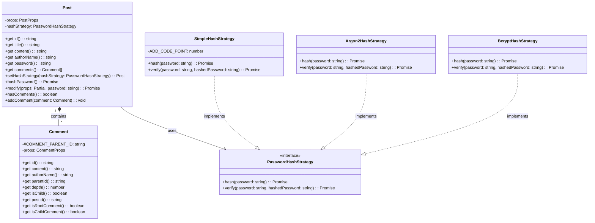

# Chapter 0 - 예제

- 주제: 게시글 모델링
- 필수: 
  - OOP에 근거하는 모델링 소스코드
  - 테스트 코드

## 시퀀스 다이어그램

```mermaid
%%{init: {'theme': 'dark'}}%%
sequenceDiagram
    actor Client
    participant Post
    participant PasswordHashStrategy
    participant Comment

    %% 1. 글 생성 시나리오
    rect rgb(44, 62, 80)
        Note over Client,PasswordHashStrategy: 글 생성 프로세스
        Client->>+Post: new Post(postProps)
        Post->>+PasswordHashStrategy: hash(password)
        PasswordHashStrategy-->>-Post: hashedPassword
        Post->>Post: hashPassword()
        Post-->>-Client: Post 인스턴스
    end

    %% 2. 글 수정 시나리오
    rect rgb(52, 73, 94)
        Note over Client,PasswordHashStrategy: 글 수정 프로세스
        Client->>+Post: modify(props, password)
        Post->>+PasswordHashStrategy: verify(password, hashedPassword)
        PasswordHashStrategy-->>-Post: boolean
        alt 비밀번호 일치
            Post->>Post: 글 내용 수정
            Post-->>Client: 수정된 Post 인스턴스
        else 비밀번호 불일치
            Post-->>-Client: throw Error
        end
    end

    %% 3. 글 삭제 시나리오
    rect rgb(59, 131, 180)
        Note over Client,PasswordHashStrategy: 글 삭제 프로세스
        Client->>+Post: delete(password)
        Post->>+PasswordHashStrategy: verify(password, hashedPassword)
        PasswordHashStrategy-->>-Post: boolean
        alt 비밀번호 일치
            Post-->>Client: 삭제 성공
        else 비밀번호 불일치
            Post-->>-Client: throw Error
        end
    end

    %% 4. 댓글 생성 시나리오
    rect rgb(95, 135, 112)
        Note over Client,Comment: 댓글 생성 프로세스
        Client->>+Post: addComment(commentProps)
        Post->>+Comment: new Comment(commentProps)
        Comment-->>-Post: Comment 인스턴스
        Post->>Post: comments.push(comment)
        Post-->>-Client: void
    end


```

## 클래스 다이어그램

## 테스트 시나리오
1. 글 생성
   - 글 생성시 비밀번호를 해싱한다.
2. 글 수정
   - 비밀번호가 일치하면 수정
3. 글 삭제
   - 비밀번호가 일치하면 제거
4. 댓글 생성