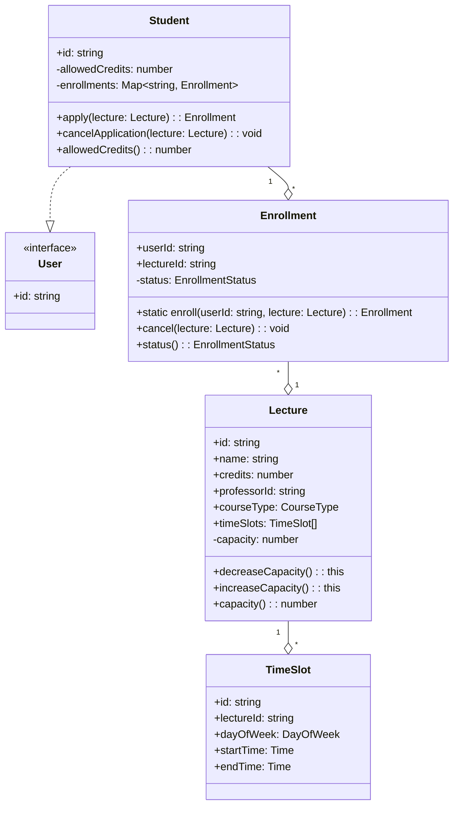

# 수강신청 시스템

## 유스 케이스

## 클래스 다이어그램

```mermaid
classDiagram
    class User {
        <<interface>>
        +id: string
    }

    class Student {
        +id: string
        -allowedCredits: number
        -enrollments: Map~string, Enrollment~
        +apply(lecture: Lecture): Enrollment
        +cancelApplication(lecture: Lecture): void
        +allowedCredits(): number
    }

    class Enrollment {
        +userId: string
        +lectureId: string
        -status: EnrollmentStatus
        +static enroll(userId: string, lecture: Lecture): Enrollment
        +cancel(lecture: Lecture): void
        +status(): EnrollmentStatus
    }

    class Lecture {
        +id: string
        +name: string
        +credits: number
        +professorId: string
        +courseType: CourseType
        +timeSlots: TimeSlot[]
        -capacity: number
        +decreaseCapacity(): this
        +increaseCapacity(): this
        +capacity(): number
    }

    class TimeSlot {
        +id: string
        +lectureId: string
        +dayOfWeek: DayOfWeek
        +startTime: Time
        +endTime: Time
    }

    Student ..|> User
    Student "1" --o "*" Enrollment
    Enrollment "*" --o "1" Lecture
    Lecture "1" --o "*" TimeSlot
```
