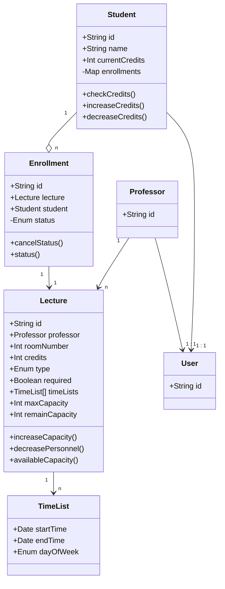

# 📚 학사 관리 시스템 - 수강 신청, 취소 (Lecture Management System)

---

## 📌 클래스 다이어그램

```mermaid
classDiagram
    class Lecture {
        +String id
        +Professor professor
        +Int roomNumber
        +Int credits
        +Enum type
        +Boolean required
        +TimeList[] timeLists
        +Int maxCapacity
        +Int remainCapacity
        +increaseCapacity()
        +decreasePersonnel()
        +availableCapacity()
    }

    class TimeList {
        +Date startTime
        +Date endTime
        +Enum dayOfWeek
    }

    class User {
        +String id
    }

    class Professor {
        +String id
    }

    class Student {
        +String id
        +String name
        +Int currentCredits
        -Map<string, Enrollment> enrollments
        +checkCredits()
        +increaseCredits()
        +decreaseCredits()
    }

    class Enrollment {
        +String id
        +Lecture lecture
        +Student student
        -Enum status
        +cancelStatus()
        +status()
    }

    %% 관계 설정
    Student --> "1 : 1" User
    Student "1" --o "n" Enrollment
    Professor --> "1 : 1" User
    Professor "1" --> "n" Lecture
    Enrollment "1" --> "1" Lecture
    Lecture "1" --> "n" TimeList
```
