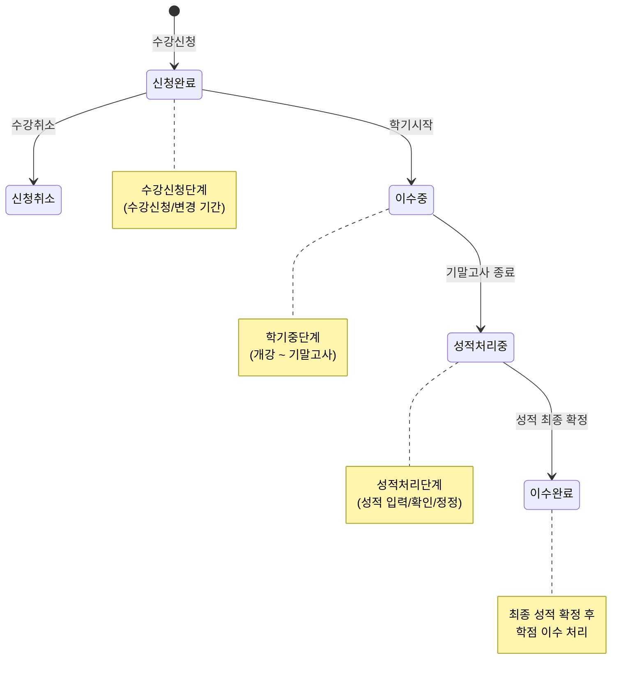
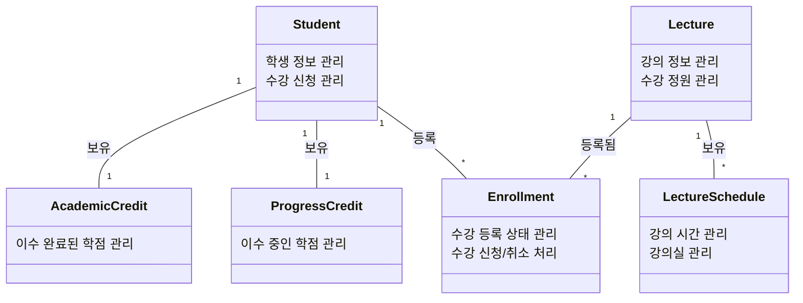
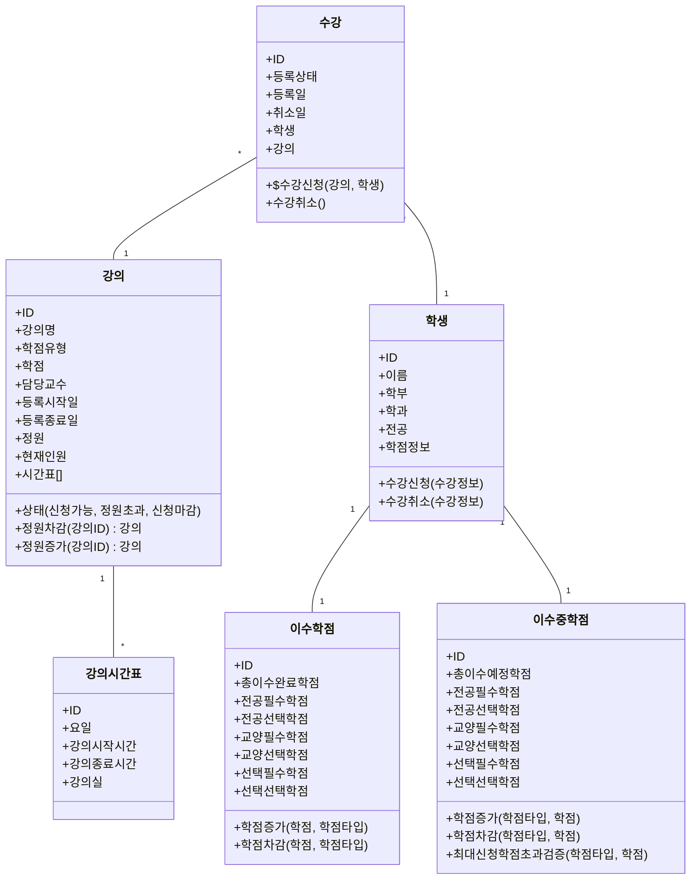
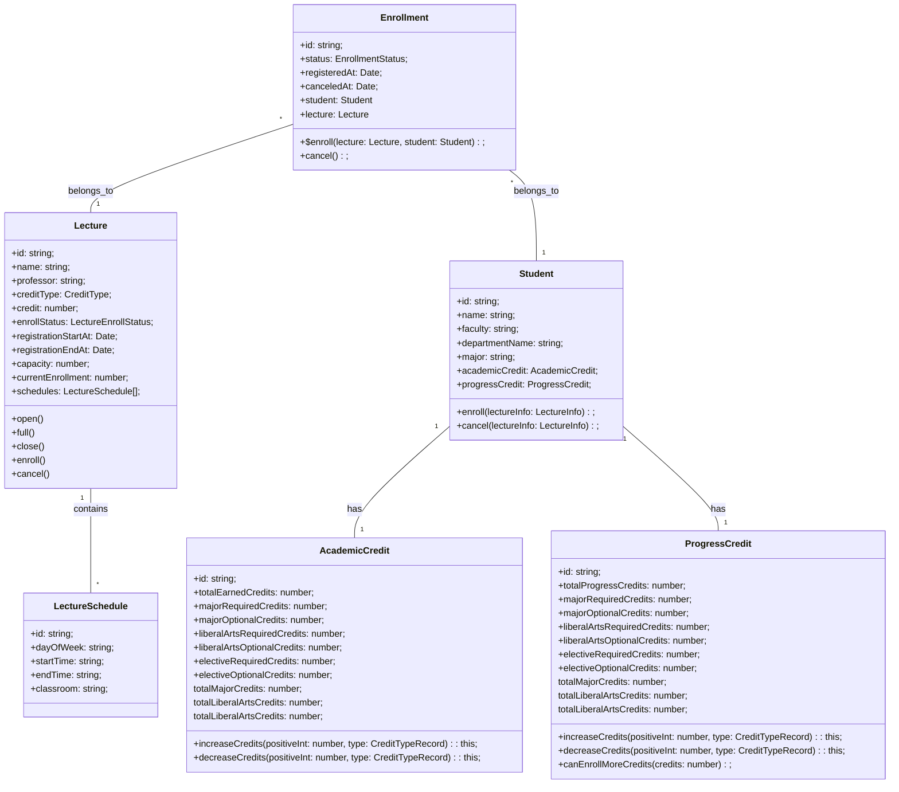
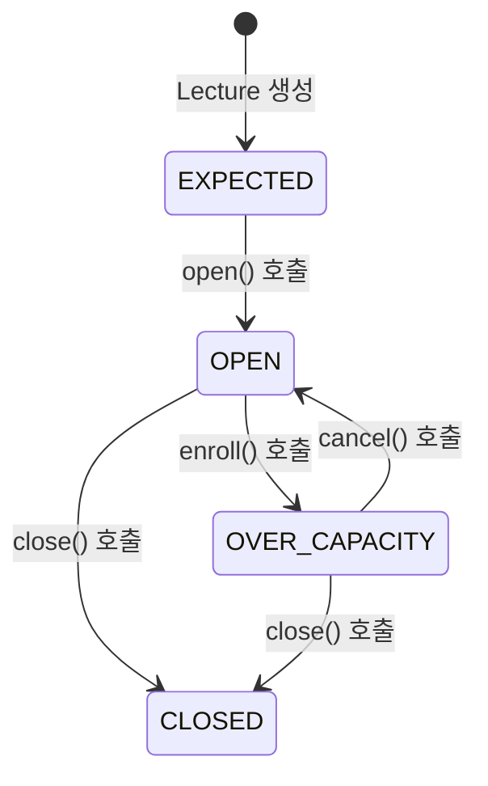

# Chapter 2  실습 - 학사관리시스템 수강신청

- 참고: [Chapter 1 토론 - 학사관리시스템 수강신청](../../chapter-1/README.md)

## 1. 재설계

토론에서 만든 구조는 바람직하지 않다고 판단되어 새롭게 설계를 진행하였고, "수강신청"이 제게는 익숙하지 않아서 다양한 시각으로 다시 바라보았습니다.

먼저 가장 모호했던 "매니저"를 제거하고, 정보를 가지지 않던 "등록"을 제거했습니다.
결과적으로 "학생"과 "강의"라는 객체만 남게 되었고, 수강 신청이라는 본질에 집중하기 위해 "학생" 하위에 있던 "수강"을 동일한 위상으로 승격시켰습니다.

이렇게 주요 객체를 동일한 위치에 다시 바라보니 "수강신청"이 커머스의 "주문하기"와 비슷한 플로우를 가진다는 것을 느꼈습니다.

### 1.1. 주문하기 vs 수강신청 플로우

주문하기 플로우(물류 제외)
  1. 상품 판매 가능 여부 검증 - 상태, 재고 등
  2. 유저 포인트 검증
  3. **주문 생성**
  4. 상품 재고 차감
  5. 유저 포인트 차감

수강 신청 플로우
  1. 강의 신청 가능 여부 검증 - 신청가능일, 수강 가능 인원 등
  2. 학생 수강 가능 여부 검증 - 최대 수강 가능 학점 넘었는지 등
  3. **수강 생성**
  4. 강의 수강 가능 인원 차감
  5. 학생 이번 학기 수강 가능 학점 차감


### 1.2. 수강 신청에 따른 학점 관리 전략

#### 💡 이수중인 학점은 확정된 학점이 아니다.   

학점은 수강신청시 생성되며, 수강신청 취소시 학점정보에서 삭제되어야 한다.  
또한 이수중인 학점은 확정된 학점이 아니기 때문에 이수 완료된 학점과 구분해서 관리할 필요가 있다.  
- 이수중인 학점과 현재 학점은 따로 관리되도록 설계가 되어야 한다.  
- 이수중인 학점은 성적 확정 후 현재 학점에 추가되어야 한다.
  - 참고: [정규학기 간드 다이어그램 확인](./도메인-분석.md#2-정규학기-간트-다이어그램)

[원본 다이어그램](./도메인-분석.md#4-정규학기에-따른-학점-상태-다이어그램)

- 수강신청시 "신청완료" 상태로 생성된다.
  - 수강신청단계에서만 가능하다.
- 수강취소시 "신청취소" 상태로 변경한다.
  - 수강신청단계 이고 "신청완료" 상태시 가능하다.
- 성적 확정 후 이수중인 학점이 현재 학점에 추가된다.
  - *다음 요구 사항에 추가 예정*


## 2. 클래스 다이어그램

### 2.1. 개념적 클래스 다이어그램(Conceptual Class Diagram)
> [!NOTE]
> 개념적 클래스 다이어그램은 세부 구현 사항을 생략하고 객체의 관계에 집중한 다이어그램입니다.



- `Student(학생)` 학생 정보를 가진다.
- `AcademicCredit(학점정보)` **현재 이수 학점**에 대한 정보를 가진다.
- `ProgressCredit(학점정보)` **진행 중인 학점**에 대한 정보를 가진다.
- `Enrollment(수강신청)` 수강 신청 정보를 가진다.
- `Lecture(강의)` 강의 정보를 가진다.
- `LectureSchedule(강의시간표)` 강의 시간표 정보를 가진다.


<details>
  <summary>💡 만약 학기별로 학점을 관리하는 요구사항이 추가된다면?</summary>
  가장 심플한 방법은 `AcademicCredit` 클래스와 `ProgressCredit` 클래스 자식 클래스로 학사별 수강 내역 두고 수강과 연결하는 구조를 생각할 수 있다.

  ```mermaid
  classDiagram
    class AcademicCredit { 현재 이수 학점 관리 }
    class ProgressCredit { 진행 중인 학점 관리 }
    class AcademicEnrollmentRecord { 학사별 수강 내역 정보 }
    class Enrollment { 수강 등록 상태 관리 }

    AcademicCredit "1" -- "*" AcademicEnrollmentRecord : 보유
    ProgressCredit "1" -- "*" AcademicEnrollmentRecord : 보유
    Enrollment "*" -- "*" AcademicEnrollmentRecord : 보유
  ```
</details>


### 2.1. 클레스 다이어그램

#### 클레스 다이어그램 - 한글


#### 클레스 다이어그램 - 영어



#### Lecture 상태 다이어그램



## 3. 테스트 케이스

### "Enrollment(수강)" 테스트 케이스
- **성공 케이스**
  - 강의가 OPEN(신청기한) 상태이고, 학생이 최대 신청 학점을 넘지 않았다면 수강신청에 성공한다.
  - 수강신청에 성공하면 강의의 수강자 수가 증가한다.
  - 수강신청에 성공하면 학생의 이수중인 학점이 증가한다.

- **실패 케이스**
  - 강의가 EXPECTED(신청예정) 상태이면 수강 신청에 실패한다.
  - 강의가 OVER_CAPACITY(정원초과) 상태이면 수강 신청에 실패한다.
  - 강의가 CLOSED(신청마감) 상태이면 수강 신청에 실패한다.
  - 학생이 최대 신청 학점을 넘었다면 수강 신청에 실패한다.

### "Student(학생)" 테스트 케이스
- **성공 케이스**
  - 학생이 수강신청을 통해 이수중인 학점을 증가시킬 수 있다.
  - 학생이 수강취소를 통해 이수중인 학점을 감소시킬 수 있다.

- **실패 케이스**
  - 학생이 최대 신청 학점을 초과하여 수강신청을 시도할 경우 실패한다.

#### "AcademicCredit" 테스트 케이스
- **성공 케이스**
  - 전공 필수, 전공 선택, 교양 필수, 교양 선택, 선택 필수, 선택 선택 학점을 각각 증가 및 감소시킬 수 있다.

- **실패 케이스**
  - 학점이 양의 정수가 아닌 경우 증가 및 감소에 실패한다.

#### "ProgressCredit" 테스트 케이스
- **성공 케이스**
  - 전공 필수, 전공 선택, 교양 필수, 교양 선택, 선택 필수, 선택 선택 학점을 각각 증가 및 감소시킬 수 있다.

- **실패 케이스**
  - 학점이 양의 정수가 아닌 경우 증가 및 감소에 실패한다.
  - 신청 학점이 최대 신청 가능 학점인 21을 초과하면 증가에 실패한다.

### "Lecture(강의)" 테스트 케이스
- **성공 케이스**
  - 강의가 OPEN(신청기간) 상태라면 enroll()에 성공한다.
  - 강의가 OPEN(신청기간) 상태라면 cancel()에 성공한다.
  - 강의가 OVER_CAPACITY(정원초과) 상태라면 cancel()에 성공한다.

- **실패 케이스**
  - 강의가 EXPECTED(신청예정) 상태라면 enroll() 및 cancel()에 실패한다.
  - CLOSE(신청마감) 상태라면 enroll() 및 cancel()에 실패한다.
  - OPEN(신청기간) 상태에서 현재 신청자가 없다면 cancel()에 실패한다.


## 4. 코드 구현

## 5. 코드 리뷰

