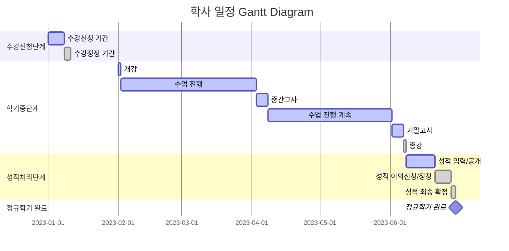
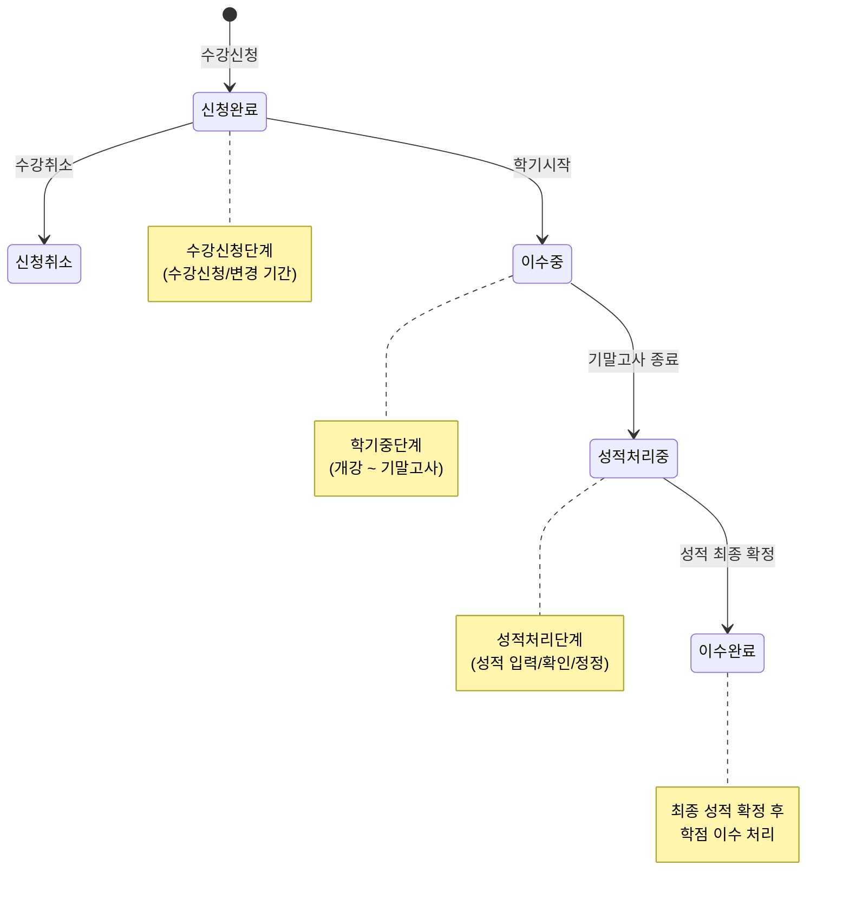

# 도메인 분석: 학사관리시스템 - 수강신청

## 1. 용어 정리
이번 주제는 **학사관리시스템**에서 "수강신청"에 필요한 모델링을 해보는 것이다.
먼저 용어 정리를 먼저 해본다.

💡 학사관리시스템이란?
> 학사관리시스템은 대학이나 직업전문학교 등에서 학사행정 업무를 통합적으로 관리하는 시스템입니다. 입학, 학생관리, 교무관리, 성적관리, 증명서관리 등의 기능을 포함하고 있습니다. 

- 학생, 교수, 직원들의 학사 관련 업무를 전산화하여 관리하는 시스템
- 수강신청, 성적관리, 학적관리, 졸업요건 관리 등의 기능 포함
- 학사 일정에 따른 각종 업무 처리와 관리를 지원

💡 학사일정이란?
> 학사 일정은 대학의 학사 운영을 위한 연간 계획표로, 학생들의 학업과 관련된 모든 주요 일정과 행사를 포함합니다. 이는 학생, 교수, 직원들이 대학의 주요 활동을 계획하고 준비하는데 필요한 기준이 됩니다.

- 대학의 연간 학사 운영 계획표
- 주요 학사 업무와 행사의 일정을 포함
- 학사 일정은 정규학기와 비정규학기로 나뉜다.

💡 정규학기와 비정규학기란?
> 정규학기와 비정규학기는 대학의 학사 운영에서 구분되는 학기 체계입니다.
> 정규학기는 필수적인 학사 운영 기간이며, 비정규학기는 선택적으로 운영되는 보충 학기의 성격을 가집니다.

정규학기
- 학사 일정에서 정규학기는 두 개의 학기로 구성된다.
  - 1학기(봄학기): 3월 초 ~ 6월 말
  - 2학기(가을학기): 9월 초 ~ 12월 말
  - 각 학기는 16주로 구성
- 대학의 기본적인 교육과정이 운영되는 기간

비정규학기
- 정규학기가 종료 후 진행되는 학기
  - 여름학기: 7월 ~ 8월
  - 겨울학기: 1월 ~ 2월
- 정규학기보다 짧은 기간 동안 집중적으로 수업 진행
- 계절학기라고도 불림
- 추가 학점 이수나 재수강을 위한 선택적 학기

## 2. 정규학기 간트 다이어그램

정규학기는 크게 3단계로 나눌 수 있다.
- 1단계 수강신청단계
- 2단계 학기중단계
- 3단계 성적처리단계

각 단계를 다이어그램으로 표현하면 다음과 같다.

## 3. 학점

대학에서 학위 취득과 졸업을 위해서는 학점이 필요하다.
전공별로 필요한 학점은 차이가 있지만 필요한 학점의 유형은 크게 3가지이다.
그리고 각각의 유형은 필수와 선택으로 나뉜다.

### 1. 전공 학점
- 전공 필수: 해당 전공 졸업을 위해 반드시 이수해야 하는 과목
- 전공 선택: 전공 관련 과목 중 학생이 선택하여 이수하는 과목
- 일반적으로 전체 졸업 학점의 35~45% 차지

### 2. 교양 학점
- 교양 필수: 모든 학생이 반드시 이수해야 하는 기초 교양 과목
- 교양 선택: 다양한 교양 과목 중 학생이 선택하여 이수
- 보통 전체 졸업 학점의 25~35% 구성

### 3. 선택 학점
- 자유 선택: 전공/교양 관계없이 학생이 자유롭게 선택하여 이수
- 일반 선택: 타 전공 과목 수강 등을 통해 취득하는 학점
- 졸업 학점의 나머지 부분을 구성

### 졸업 요건
- 총 졸업 학점: 보통 130~140학점
- 전공/교양/선택 각 영역별 최소 이수 학점 충족 필요
- 평점 평균(GPA) 기준 충족 필요

## 4. 정규학기에 따른 학점 상태 다이어그램

