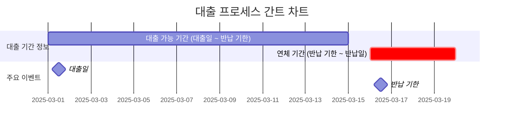
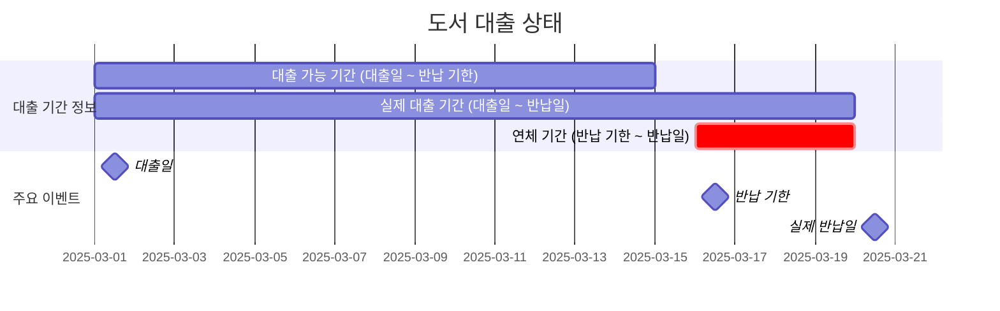
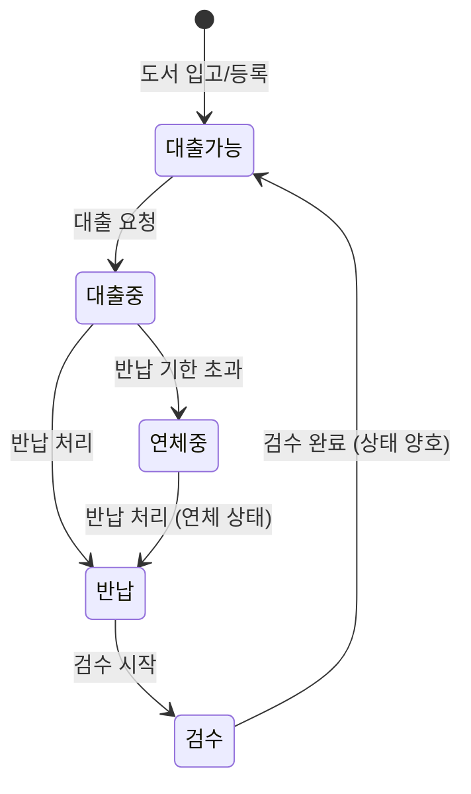
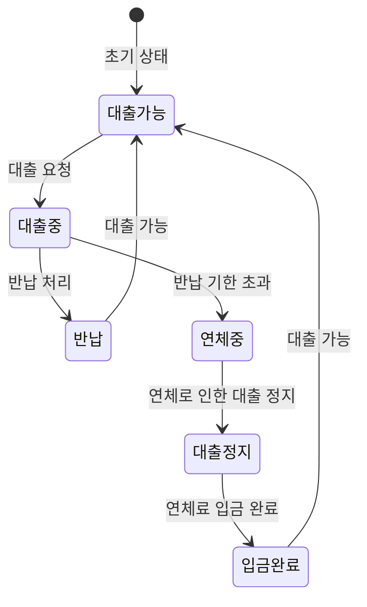

# **도메인 분석: 도서관 관리 시스템 - 대출 시스템**

## 1. 용어 정리

> [!NOTE] 
> ### 💡 도서관리 시스템 이란?  
> **도서자료를 데이터베이스화 하고 도서대출 및 반납, 서고정리, 장서점검, 자료출입통제 등을 자동화 하는 시스템**
> - 도서 대출을 하는 시스템 (반납, 대출 포함한다.)
> - 연체 관리 시스템을 만든다.
> - 입출고 등을 자동화 - 책이 입고 되고, 출고 되는 시스템
> - 도서 대출 선점 시스템

> [!NOTE] 
> ### 💡 도서 연체 관리 시스템이란?
> **도서자료를 반납기일을 초과한 경우 발생하는 페널티에 대한 시스템**
> - 도서관 관리 시스템이기 때문에 연체료 보단 연체시 대출 제한을 두는 것으로 한다.
> - 연체 페널티는 "연체료" 방식으로 통일한다.
>    - 선택사항:
>      - 3진 아웃 블랙리스트
>      - 장기 연체자 관리

> [!NOTE]
> 도서자료를 반납기일이란?
> 대출일, 반납일, 대출 가능 기한, 대출 기한, 반납기일
> (dateFormat: `YYYY-MM-DD`)
> - 대출 가능 기한: 대출 가능한 기한( `YYYY-MM-DD` ~  `YYYY-MM-DD` +7일 ) 
> - 대출일: 회원이 도서를 대출한 날짜
> - 반납일: 회원이 도서를 반납한 날짜
> - 반납기한: “대출 가능한 기한”의 마지막날
> - 연체기간: 반납 기한을 초과한 날 부터 이후의 기간을 모두 연체 기간으로 한다.

## 2. 비즈니스 규칙

- 대출 가능 기한은 15일로 한다.
- 연체시 하루당 500원의 연체료가 발생한다.
- 연체료를 납부하지 않으면 `대출정지` 상태로 변경되어 대출이 제한된다.
- 용어는 “대출”과 “반납”으로 통일한다.

## 3. 간트 차트

### 대출 프로세스 간트 차트

- 대출일: 3월 1일
- 반납 기한: 3월 15일 자정까지
- 연체 기간: 3월 16일부터~

### 간트 차트 예시 - 실제로 연체한 경우

- 대출일: 3월 1일
- 반납 기한: 3월 15일까지
- 연체 기간: 3월 16일부터~
- 대출 가능 기간: 3월 1일부터 3월 15일까지
- 실제 대출 기간: 3월 1일 ~ 3월 20일(🚨연체🚨)

### 도서 상태 다이어그램

### 대출 상태 다이어그램

